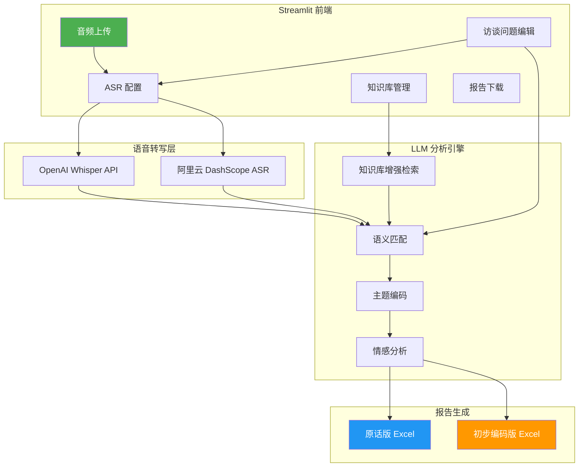

# 🎙️ 访谈智能整理与分析系统

> **Interview Intelligence Organization & Analysis Agent**
>
> 一款基于 LangGraph Agent 的智能化访谈处理系统，支持音频转写 → 语义匹配 → 双版本报告生成的全自动流程。专为游戏/心理学/用户研究领域的访谈分析设计。

[](https://github.com/IanGu2003/interview-analyzer/actions/workflows/ci.yml)
[](https://interview-analyzer.streamlit.app)
[](https://www.python.org/)
[](https://opensource.org/licenses/MIT)

---

## 📸 产品效果

> *（请在此处插入应用界面截图）*

| 上传与处理 | 报告下载 | 知识库管理 |
|:---:|:---:|:---:|
|  |  |  |

---

## 🚀 快速开始

### 在线体验（推荐）

👉 **[在线 Demo](https://interview-analyzer.streamlit.app)** — 打开即用，无需安装

### 本地部署

```bash
# 1. 克隆仓库
git clone https://github.com/IanGu2003/interview-analyzer.git
cd interview-analyzer/streamlit_app

# 2. 安装依赖
pip install -r requirements.txt

# 3. 配置 API Key（编辑 app.py 中的默认值，或通过环境变量）
export LLM_API_KEY="your-api-key-here"

# 4. 启动应用
streamlit run app.py
```

### Docker 部署

```bash
docker build -t interview-analyzer ./streamlit_app
docker run -p 8501:8501 -e LLM_API_KEY="your-key-here" interview-analyzer
```

---

## 🏗️ 系统架构



### 核心流程

```
用户上传音频
    │
    ▼
┌─────────────────────────────────────┐
│  步骤 1: 音频预处理                  │
│  - ffmpeg 转为标准 WAV (16kHz/mono)  │
└─────────────────────────────────────┘
    │
    ▼
┌─────────────────────────────────────┐
│  步骤 2: ASR 语音转写               │
│  - OpenAI Whisper / 阿里云DashScope  │
└─────────────────────────────────────┘
    │
    ▼
┌─────────────────────────────────────┐
│  步骤 3: LLM 语义分析与匹配          │
│  - 提取受访者回答                    │
│  - 匹配到结构化问题                  │
│  - 知识库增强（RAG）                 │
└─────────────────────────────────────┘
    │
    ▼
┌─────────────────────────────────────┐
│  步骤 4: 双版本报告生成              │
│  - 📄 原话版: 问题 ↔ 回答直接映射    │
│  - 📊 编码版: 主题编码 + 情感 + 关键词│
└─────────────────────────────────────┘
```

---

## ✨ 核心功能

| 功能 | 说明 | 技术实现 |
|------|------|---------|
| **🎤 语音转写** | 支持 OpenAI Whisper 和阿里云 DashScope 两种 ASR | `faster-whisper`, `OpenAI API`, `DashScope API` |
| **🧠 语义匹配** | LLM 自动从混音对话中提取受访者回答并匹配到问题 | `LangChain` + `DeepSeek` / `OpenAI` |
| **📚 RAG 知识库** | 可导入历史访谈记录和术语表，提升分析准确性 | 纯 Python 关键词检索 + LLM 重排 |
| **📊 双版本报告** | 同时输出原话版和编码版 Excel | `openpyxl` |
| **🔍 主题编码** | 基于扎根理论自动生成一级编码 + 二级编码 | `gpt-4` / `deepseek-chat` |
| **💾 会话记忆** | 滑动窗口保留最近 20 轮对话 | `LangGraph` Memory |

---

## 🛠️ 技术栈

| 类别 | 技术 |
|------|------|
| **前端框架** | [Streamlit](https://streamlit.io/) |
| **AI Agent 框架** | [LangGraph](https://langchain-ai.github.io/langgraph/) + [LangChain](https://www.langchain.com/) |
| **大语言模型** | DeepSeek / OpenAI (兼容 API) |
| **语音识别** | OpenAI Whisper API / 阿里云 DashScope Paraformer |
| **对象存储** | 阿里云 OSS |
| **报告生成** | openpyxl (Excel) |
| **测试** | pytest |
| **CI/CD** | GitHub Actions |
| **容器化** | Docker |
| **部署** | Streamlit Cloud / 本地 / Docker |

---

## 📁 项目结构

```
interview-analyzer/
├── streamlit_app/           # Streamlit 应用主目录
│   ├── app.py               # 主入口（~600行）
│   ├── requirements.txt     # 依赖声明
│   ├── utils/
│   │   ├── asr.py           # ASR 模块（Whisper + 阿里云）
│   │   ├── llm_utils.py     # LLM 工具（语义匹配、编码）
│   │   ├── memory.py        # 会话记忆管理
│   │   ├── report.py        # 双版本 Excel 报告生成
│   │   └── knowledge_base.py # RAG 知识库
│   └── assets/              # 示例资源
├── tests/                   # 单元测试
│   ├── test_memory.py
│   ├── test_knowledge_base.py
│   ├── test_asr.py
│   └── test_report.py
├── docs/                    # 文档
│   ├── ARCHITECTURE.md      # 技术架构文档
│   └── images/              # 截图资源
├── .github/workflows/       # CI 配置
│   └── ci.yml
├── Dockerfile               # Docker 构建文件
├── README.md                # 本文件
└── LICENSE                  # MIT 许可
```

---

## 📋 测试覆盖

```bash
# 运行全部测试
pytest tests/ -v

# 运行特定模块测试
pytest tests/test_memory.py -v
pytest tests/test_knowledge_base.py -v
```

CI 状态：

---

## 🧠 设计亮点

### 1. LLM-First 设计
尽可能利用 LLM 的语义理解能力（如情感分析、主题编码），减少规则代码。仅在必要时（ASR、文件操作）使用工具。

### 2. 双模式报告
同一份访谈数据同时输出「原话版」和「编码版」，兼顾原始数据完整性和分析效率。

### 3. 轻量 RAG
纯 Python 实现的知识库，无需向量数据库，部署零额外依赖，降低使用门槛。

### 4. 灵活的 ASR 切换
支持 OpenAI Whisper 和阿里云 DashScope 两种方案，适配不同网络环境和预算。

---

## 🎯 应用场景

- **游戏用户研究** — 分析玩家访谈录音
- **心理学访谈** — 质性研究数据整理与编码
- **产品用户体验** — 用户访谈记录的结构化处理
- **学术研究** — 扎根理论编码辅助工具

---

## 📄 License

MIT License — 自由使用、修改和分发。

---

## 🙋 关于我

本项目是我用于申请 **AI 产品实习** 的作品之一。如果你对这个项目感兴趣，欢迎通过 GitHub 联系我！

> **技术栈**：LangGraph · LangChain · Streamlit · DeepSeek · OpenAI · Docker · GitHub Actions